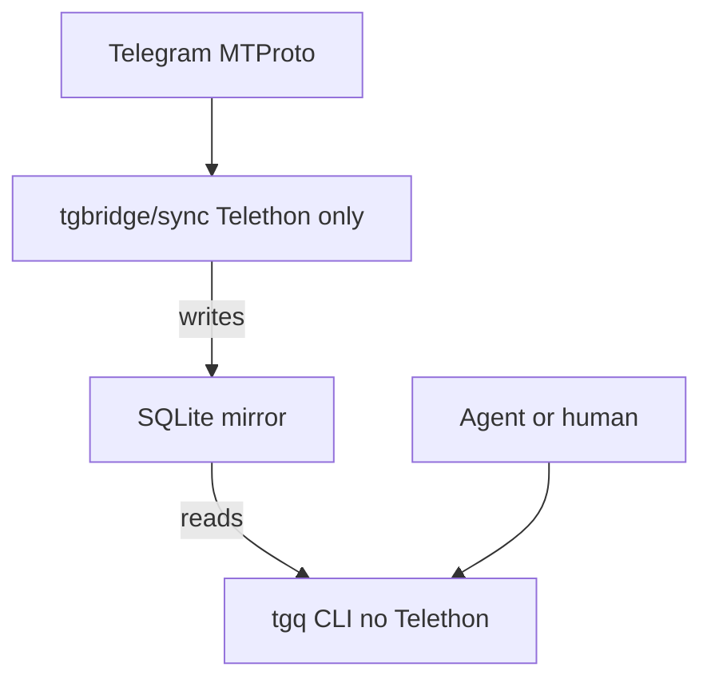

# tg-agent-bridge

Local bridge between a Telegram user account and AI agents. The agent never talks to Telegram — it talks to a SQLite mirror through the CLI `tgq`.

## Status

This repository is a **product spec**, not a working tool yet. The Python package, sync daemon, and CLI are not in the tree. What follows is the intended design; treat command examples as the target interface, not something you can run today.

Local agent instructions and workflows are intentionally excluded from version control.

## Why

Three properties drive the design:

1. **Cheap local search** — queries hit SQLite, not the Telegram API or an LLM context window on every lookup.
2. **Human control of egress** — nothing leaves the machine as a Telegram message without an explicit human approve step.
3. **Every write goes through outbox** — including retries and “utility” messages. There is no side path that calls `send_message` directly.

## How it works

Dependencies are one-way. Telethon exists only in the sync layer; the CLI must not import it.



- **`tgbridge/sync/`** — the only code that knows about Telegram. Timer-based incremental sync into SQLite.
- **`tgbridge/db/`** — schema and migrations; the contract between layers.
- **`tgbridge/cli/`** — `tgq`. Reads the mirror, never MTProto. Fast startup, tests against fixture DBs with no network.

## Target interface

Planned CLI surface (not implemented):

```bash
# Search the local mirror
tgq search --tag urgent --since 24h --format jsonl
tgq search --peer work-chat --q "release OR deploy" --limit 20

# Propose a send — writes outbox only; does not transmit
tgq send --peer lena --body "..."

# Human approval; a separate sender process transmits only status=approved
tgq outbox approve 17
```

Other planned commands: `thread`, `tail`, `digest`, `peers`, `tag`, `retag`, `sync`, `doctor`, `outbox list|reject|send`.

Writes support `--dry-run`. Secrets belong in the environment or `~/.config/tgq/secrets.env` (mode `0600`), never in the repo. Sync scope is `watchlist.yaml`; send requires `allow_send` in config **and** `peers.sendable`.

## Data model (summary)

| Rule | Why |
|------|-----|
| Message PK is `(peer_id, msg_id)` | `msg_id` is unique only within a dialog |
| Soft delete via `deleted_at` | Agents that already cited a handle still get a clear answer |
| Tags in a separate table with `source` | Distinguish rule / manual / agent tags; never a CSV field |
| Always store `raw_json` | Retag and new fields without re-downloading history |
| Time is UTC unix int | Keeps `--since` comparisons and indexes honest |
| `sync_state` moves in the same transaction as the batch | Avoid holes or infinite replays after a crash |
| Only path out is `outbox` with `status=approved` | No direct Telethon send |

The database is **unencrypted** and holds private chat history. Do not put it in cloud-synced folders; treat the file like sensitive mail.

## Safety and ToS

This is a userbot acting as a real person. Defaults and hard boundaries:

- Sync **only** peers listed in `watchlist.yaml`. Absence from the DB is the privacy boundary — not a read-time filter.
- Account is **read-only** until send is enabled in config and each message is approved. `approve` is human-only.
- Telethon session file: mode `0600`, gitignored, never logged. Log formatters redact secrets centrally.
- Every write action is recorded in `audit`.

**Will not implement** (even “just for a test”):

- Mass sends or send-to-list
- Unattended auto-replies
- Syncing or scraping peers outside the watchlist
- Aggressive polling faster than about once per minute per peer
- FloodWait evasion via session/account rotation

Telegram limits accounts by behavior. Convenience is not worth a locked human account.

## Development notes

When implementation starts:

- Tests never hit the network. Sync uses a mocked client and fixture messages; CLI uses a temporary DB filled by factories.
- Sync bugs: put the problematic `raw_json` in a fixture and write a failing test before changing the daemon. Live-API debug loops invite FloodWait.
- CLI stdout is a public API consumed by agents. Adding fields is fine; renaming or removing requires a `--format-version` bump and a CHANGELOG entry.
- Any write path (`sync`, `send`, bulk tag) must support `--dry-run`.
- No ORM. Open connections with `journal_mode=WAL` and `busy_timeout=5000` so the daemon can write while agents read.
- FTS5 is external-content over `messages.text`, kept in sync with triggers.

## Intentionally not in v1

Closed decisions — do not “improve” them without an explicit product change:

- **No MCP server in the core.** Interface is CLI only; MCP can sit on top later.
- **No real-time update stream.** Timer sync trades minutes of lag for a simple, restartable daemon.
- **No LLM on the hot path.** Auto-tagging is rule-based at write time. Optional selective LLM tagging is an explicit command, not the message pipeline.
- **No second store.** SQLite until measured pain says otherwise.
