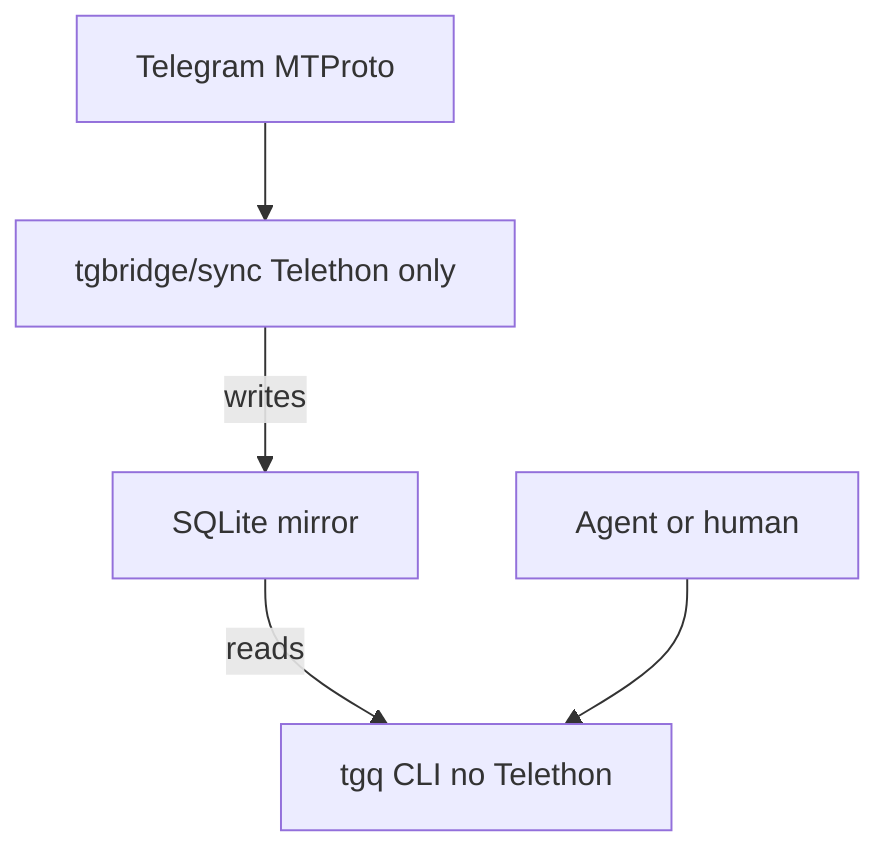

# tg-agent-bridge

Local bridge between a Telegram user account and AI agents. The agent never talks to Telegram — it talks to a SQLite mirror through the CLI `tgq`.

## Status

v0.1 is implemented for Python 3.12 and 3.13 on macOS and Linux. It includes
the SQLite mirror, offline-tested incremental sync, deterministic read CLI,
and moderated outbox.

Local agent instructions and workflows are intentionally excluded from version control.

## Why

Three properties drive the design:

1. **Cheap local search** — queries hit SQLite, not the Telegram API or an LLM context window on every lookup.
2. **Human control of egress** — nothing leaves the machine as a Telegram message without an explicit human approve step.
3. **Every write goes through outbox** — including retries and “utility” messages. There is no side path that calls `send_message` directly.

## How it works

Dependencies are one-way. Telethon exists only in the sync layer; the CLI must not import it.



- **`tgbridge/sync/`** — the only code that knows about Telegram. Timer-based incremental sync into SQLite.
- **`tgbridge/db/`** — schema and migrations; the contract between layers.
- **`tgbridge/cli/`** — `tgq`. Reads the mirror, never MTProto. Fast startup, tests against fixture DBs with no network.

## Install and configure

```bash
uv sync --dev
cp watchlist.example.yaml watchlist.yaml
export TGQ_DB="$HOME/.local/share/tgq/messages.sqlite"
export TGQ_API_ID="..."
export TGQ_API_HASH="..."
```

Credentials may instead be stored in `~/.config/tgq/secrets.env`, which must
have mode `0600`. The Telethon session defaults to `tgq.session`; keep it local.

The default MTProto port is `443`. Some hosted environments classify ports 80
and 443 as HTTP and intercept raw MTProto. Cursor Grok Bot computers currently
allow the same Telegram transport on port 5222:

```bash
export TGQ_TELEGRAM_PORT=5222
uv run tgq --db "$TGQ_DB" sync
```

The environment variable overrides `telegram.port` in `watchlist.yaml`.
HTTP(S) proxy variables do not carry raw MTProto; the port override is explicit
and never triggers automatic port cycling.

## CLI

```bash
# Populate/update the mirror. All Telegram reads are limited to watchlist.yaml.
uv run tgq --db "$TGQ_DB" sync

# Search the local mirror
uv run tgq --db "$TGQ_DB" --format jsonl search --tag urgent --since 24h
uv run tgq --db "$TGQ_DB" search --peer work-chat --q "release OR deploy" --limit 20

# Propose a send — writes outbox only; does not transmit
uv run tgq --db "$TGQ_DB" send --peer lena --body "..."

# Human approval; a separate sender process transmits only status=approved
uv run tgq --db "$TGQ_DB" outbox approve 17
uv run tgq --db "$TGQ_DB" outbox send
```

Other commands: `thread`, `tail`, `digest`, `peers`, `tag`, `retag`, `doctor`,
and `outbox list|reject`.

Writes support `--dry-run`. Secrets belong in the environment or `~/.config/tgq/secrets.env` (mode `0600`), never in the repo. Sync scope is `watchlist.yaml`; send requires `allow_send` in config **and** `peers.sendable`.

## Data model (summary)

| Rule | Why |
|------|-----|
| Message PK is `(peer_id, msg_id)` | `msg_id` is unique only within a dialog |
| Soft delete via `deleted_at` | Agents that already cited a handle still get a clear answer |
| Tags in a separate table with `source` | Distinguish rule / manual / agent tags; never a CSV field |
| Always store `raw_json` | Retag and new fields without re-downloading history |
| Time is UTC unix int | Keeps `--since` comparisons and indexes honest |
| `sync_state` moves in the same transaction as the batch | Avoid holes or infinite replays after a crash |
| Only path out is `outbox` with `status=approved` | No direct Telethon send |
| Peer `slug` is immutable after insert | `slug#msg_id` citations must not break |

The database is **unencrypted** and holds private chat history. Do not put it in cloud-synced folders; treat the file like sensitive mail.

## Safety and ToS

This is a userbot acting as a real person. Defaults and hard boundaries:

- Sync **only** peers listed in `watchlist.yaml`. Absence from the DB is the privacy boundary — not a read-time filter.
- Account is **read-only** until send is enabled in config and each message is approved. `approve` and `reject` are human-only by contract and agent instructions, not an OS sandbox: a same-UID process can still invoke those commands. The technical boundary is process split — enqueue cannot transmit, and the sender reads only `status=approved`.
- Telethon session file: mode `0600`, gitignored, never logged. Log formatters redact secrets centrally.
- Every write action is recorded in `audit`.

**Will not implement** (even “just for a test”):

- Mass sends or send-to-list
- Unattended auto-replies
- Syncing or scraping peers outside the watchlist
- Aggressive polling faster than about once per minute per peer
- FloodWait evasion via session/account rotation

Telegram limits accounts by behavior. Convenience is not worth a locked human account.

## Development notes

- Tests never hit the network. Sync uses a mocked client and fixture messages; CLI uses a temporary DB filled by factories.
- Sync bugs: put the problematic `raw_json` in a fixture and write a failing test before changing the daemon. Live-API debug loops invite FloodWait.
- CLI stdout is a public API consumed by agents. Adding fields is fine; renaming or removing requires a `--format-version` bump and a CHANGELOG entry.
- Any write path (`sync`, `send`, bulk tag) must support `--dry-run`.
- No ORM. Open connections with `journal_mode=WAL` and `busy_timeout=5000` so the daemon can write while agents read.
- FTS5 is external-content over `messages.text`, kept in sync with triggers.

Run all checks:

```bash
uv sync --dev
uv run pytest
uv run ruff check .
uv run basedpyright
```

## Intentionally not in v1

Closed decisions — do not “improve” them without an explicit product change:

- **No MCP server in the core.** Interface is CLI only; MCP can sit on top later.
- **No real-time update stream.** Timer sync trades minutes of lag for a simple, restartable daemon.
- **No LLM on the hot path.** Auto-tagging is rule-based at write time. Optional selective LLM tagging is an explicit command, not the message pipeline.
- **No second store.** SQLite until measured pain says otherwise.
- **No OS-level human-presence for approve.** Touch ID / polkit are out of v0.1. Approval is a confused-deputy control (process split + human workflow), not a sandbox.

## License

MIT. Copyright (c) 2026 Igor Kropochev. Contributions are inbound=outbound under the same license; there is no CLA.
